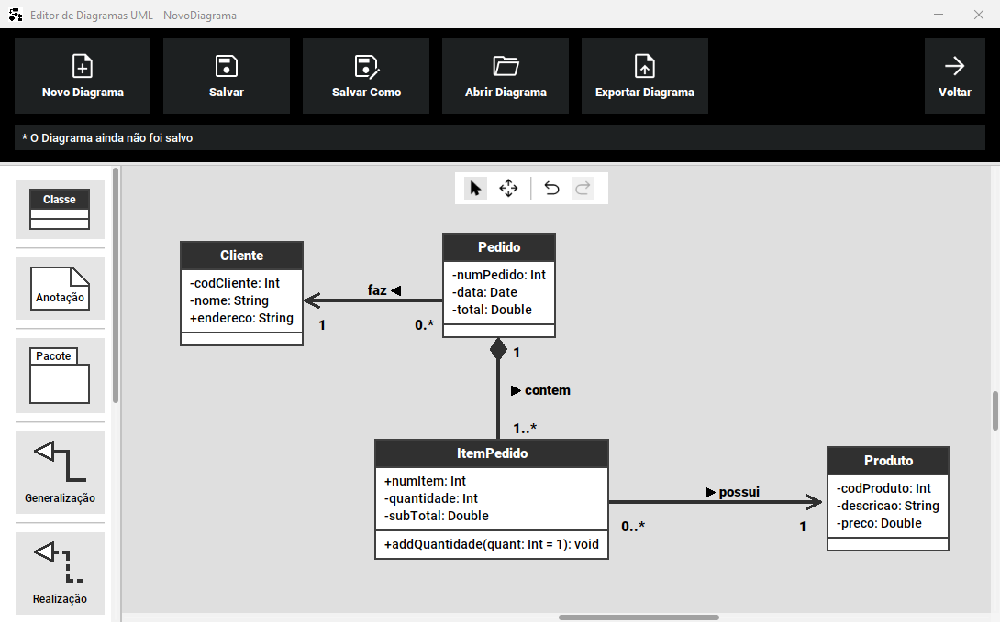
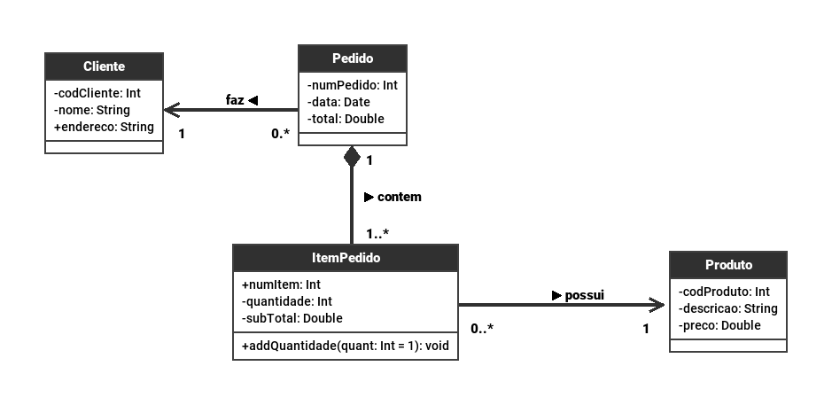
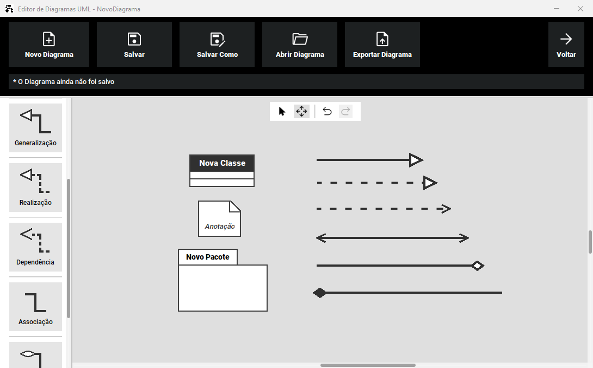

# (TP1 - 2022-1): Editor de Diagramas UML

<h1 align="center">
    
</h1>
<p align="center">Ferramenta de modelagem e elaboração de diagramas de classe UML</p>

* [Sobre o Projeto](#sobre-o-projeto)
* [Execução](#execução)
    * [Requisitos](#requisitos)
    * [Como executar](#como-executar)
* [Tecnologias Utilizadas](#tecnologias-utilizadas)
* [Funcionalidades](#funcionalidades)
* [Showcase](#showcase)

---

## Sobre o projeto

O Editor de Diagramas UML se trata de uma ferramenta para a elaboração de diagramas de software seguindo o padrão [UML (Unified Modeling Language)](https://pt.wikipedia.org/wiki/UML#).

A UML é uma linguagem de notação que tenta padronizar a especificação, construção e documentação de sistemas de software. Ela disponibiliza várias de convenções e ideias sobre como especificar uma série de sistemas e seus componentes. Dentre esses, o aplicativo se foca em representar [diagramas de classe](https://pt.wikipedia.org/wiki/UML#Diagramas_de_classes), permitindo modelar sistemas simples.

O aplicativo foi desenvolvido como projeto final da disciplina de Técnicas de Programação 1 (TP1) ofertada pela [Universidade de Brasília](https://www.unb.br/) durante o semestre 2022/1. 

<h1 align="center">
    
</h1>

---

## Execução

### Requisitos

Para a execução do projeto basta ter o Java 17 ou superior instalado no seu sistema.

### Como executar

A maneira mais fácil de executar e testar o projeto é usando o `.jar` disponível no repositório.

Primeiramente faça o clone deste repositório para o seu ambiente local ou então baixe o ZIP com todos os arquivos.

```
git clone https://github.com/enzzoMs/TP1-EditorUML.git
```

Abra o terminal ou prompt de comando e navegue até o diretório raiz do projeto:

```
cd ./TP1-EditorUML
```

Utilize o seguinte comando:

```
java -jar EditorUML.jar
```

De forma alternativa também é possível abrir o projeto pela IDE [Intellij Idea](https://www.jetbrains.com/idea/), que oferece uma maneira rápida de modificar, compilar e executar o aplicativo.

---

## Tecnologias utilizadas

Linguagem: [Java](https://www.java.com/pt-BR/)

Interface gráfica: [Java Swing](https://docs.oracle.com/javase/7/docs/api/javax/swing/package-summary.html)

Bibliotecas Adicionais:
* [FlatLaf](https://www.formdev.com/flatlaf/) - _Look and Feel_ moderno para aplicações desktop com Java Swing.
* [MigLayout](https://www.miglayout.com/) - Um _Layout Manager_ para Java Swing.

---

## Funcionalidades 

* Estruturas: Fornece 3 tipos de estruturas: 
  * Classe: Componente principal dos diagramas.
  * Anotação: Permite adicionar comentários em locais específicos.
  * Pacote: Estrutura redimensionável para agrupar outros componentes.

* Relações: Fornece 6 tipos de relações para expressar diversos tipos de conexões entre componentes: Associação, Dependência, Generalização, Realização, Agregação e Composição.

* Abrir e Salvar Diagramas: Permite salvar os diagramas no formato `.txt` em qualquer diretório. Esses arquivos podem então ser abertos pelo Editor UML para continuar a edição. 

* Quadro Branco: O aplicativo funciona por meio de um esquema de quadro branco, onde os componentes podem ser livremente colocados e movimentados para qualquer posição.

* Componentes Personalizáveis: Todos os componentes podem ser modificados, alterando as características de cada um para modelar o sistema desejado de forma precisa.

* Exportação: Os diagramas podem ser exportados como imagens `.png`

---

## Showcase

<h1 align="center">
    
</h1>

<p align="center">Exemplo de um diagrama construído no aplicativo.</p>


<h1 align="center">
    
</h1>

<p align="center">Diagrama acima exportado como .png</p>

<h1 align="center">
    
</h1>

<p align="center">Todos os componentes fornecidos pelo Editor.</p>

---

## Créditos

* A ideia, funcionamento e alguns elementos gráficos foram inspirados pelo software [Dia Diagram Editor](http://dia-installer.de/).

* Logo do aplicativo retirada de [Flaticon - Freepik](https://www.flaticon.com/free-icon/uml_5332798?term=uml&page=1&position=7&origin=search&related_id=5332798) 
